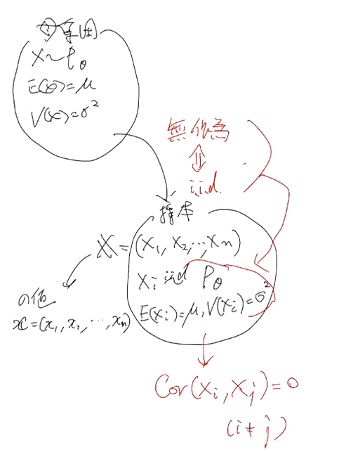

2020年 12月 16日
 
 
 
 

第12回 数理統計 レポート
 
 

小森 一輝

 
 
 

## 6.1  母集団, 母集団確率変数, 標本, 統計量
### 6.1.1 母集団, 標本

**定義6.1** 母集団, 母集団分布, 母数, 母数空間

興味の対象となる集合全体を **母集団** (population) という.
特に, 属する対象の個数が有限の場合には, **有限母集団** (finite distribution) とよび, 無限の場合には, **無限母集団** (infinite population) とよぶ. 

 母集団は, 特定の性質をもった (確率変数 X の) 確率分布 $P_\theta$ によって特徴づけられていることを仮定する.
このとき, その分布のことを **母集団分布** (population distribution) とよび, 
確率変数のことを **母集団確率変数** (population random variable) とよぶ. 母集団分布が **母数 (パラメータ) $\theta$** をもつことを仮定する.
 すべての母数 $\theta$ の集合を $\Theta$ で表し, **母数空間** (parameter space) とよぶ.
 このとき, 確率分布 $P_\theta$ は母数空間 $\Theta$ 上で定義されているということもある.
 このとき, 母集団は分布族 $\mathscr{P} = \{P_\theta \mid \theta \in \Theta \}$ に属するという.
 特に, $P_\theta$ の平均 $E(X)$ のことを **母平均** (population mean) とよび, $\mu$ と記す.
 分散 $V(X)$ のことを **母分散** (population variance) とよび, $\sigma^2$ と記す.

 複数の母数を含む母集団分布を考える場合, 母数の一部に興味があり, 他の母数に興味がない場合がある.
 この場合の未知であるが興味のない母数のことを **攪乱母数** あるいは **局外母数** (nuisance parameter) という.

 

 **定義6.2** 標本抽出, 標本, 標本値, 標本の大きさ, 標本空間
 母集団から要素を取り出すことを **標本抽出** (sampling) とよび, 取り出される要素のことを **標本** (sample) とよぶ.
 このとき, 標本に対して注目している値を標本とよぶこともある.
 簡単のため, ある分布族 $\mathscr{P}$ に属する母集団からの標本のことを $\mathscr{P}$ に属する確率分布 $P_\theta$ からの標本ということもある.

 このとき, 取り出した要素を元に戻す抽出を **復元抽出** (sampling with replacement) とよび, 元に戻さない抽出のことを **非復元抽出** (sampling without replacement) とよぶ.

 標本の要素 $X_i (i = 1,2,\dots)$ は母集団確率分布に従う確率変数であり, 標本は $\textbf{X} = (X_1,X_2,\dots)$ で表される.
 標本 $\textbf{X}$ の実現値を **標本値** (sample value) または **観測値** (observation value) とよび, $x = (x_1,x_2,\dots)$ で表す.
 取り出される要素の個数は **標本の大きさ** (sample size) とよばれる.
 標本の値域は **標本空間** (sample space) となり, 大きさ $n$ の標本の標本空間は $\mathscr{X}^n$ で表される.
 このとき, $x$ は $\mathscr{X}^n$ のある点となる.

**定義 6.3** 無作為標本
確率変数 $X_1,X_2,\dots X_n$ が互いに独立で同一の母集団分布 $P_\theta$ に従うとき, $\mathbb{X}=(X_1,X_2,\dots X_n)$ はこの母集団からの **大きさ $n$ の無作為標本** (random sample of size n) であるという.

 

**定理6.1** 無作為標本の性質

$F_X(x; \theta)$ を母集団確率変数 $X$ の母数 $\theta$ をもつ分布関数とすると, 無作為標本 $\mathbb{X}=(X_1,X_2,\dots X_n)$ の同時確率分布 $F_{\mathbb{X}}(x; \theta)$ は,

$$
F_{\mathbb{X}}(x; \theta) = \prod_{i=1}^{n}F_X(x; \theta)
$$

標本 $\mathbb{X}$ の同時分布関数が$X_1, X_2, \dots, X_n$ の分布関数の積となる.

を満たす. また,確率変数 $X$ が確率変数 (または, 確率密度関数) $f_X(x; \theta)$ を持つ場合は, 標本 $\mathbb{X}$ の同時確率関数 (または, 同時確率密度関数) $f_{\mathbb{X}}(x; \theta)$ は,

$$
f_{\mathbb{X}}(x; \theta) = \prod_{i=1}^{n}f_X(x; \theta)
$$

標本 $\mathbb{X}$ の同時確率(密度)関数が$X_1, X_2, \dots, X_n$ の確率(密度)関数の積となる.

を満たす. ここで, $x = (x_1,x_2,\dots x_n), x \in \mathscr{X}^n$ である.

 

### 6.1.2 統計量とその性質

**定義6.4** 統計量, 標本分布
標本 $\mathbb{X} = (X_1,X_2,\dots X_n)$ の可測関数 $T_n(X_1,X_2,\dots X_n)$ を **統計量** (static) という.
統計量の分布を **標本分布** (sampling distribution) という.

統計量は確率変数の可測関数であり, それ自身も確率変数となる.
統計量は標本のみに依存し, 母数には依存しないが, 標本分布は母数に依存する.

例:
$$
\begin{cases}
    \overline{X} = \frac{1}{n} \sum_{i=1}^{n} X_i \qquad (\overline{X} \verb|~| n)\\
    s^2 = \frac{1}{n} \sum_{i=1}^{n} (X_i - \overline{X})^2 \qquad (\frac{nS^2}{\sigma^2} \verb|~| \chi^2)
\end{cases}
$$