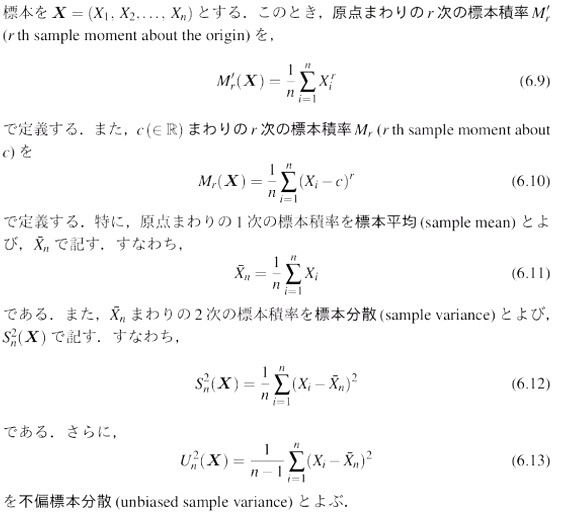
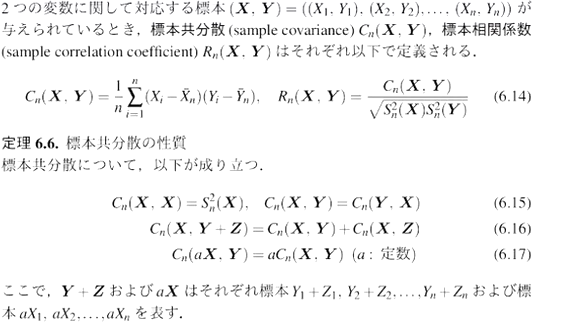
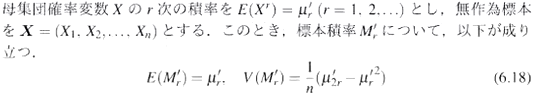
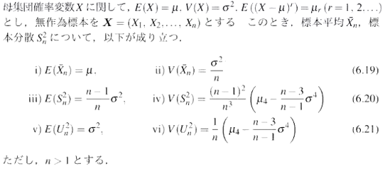
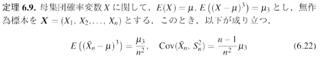
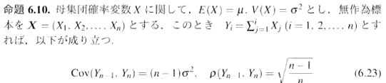

2021年 01月 13日
 
 
 
 

第14回 数理統計 レポート
 
 

小森 一輝

 
 
 

### **定義6.6** 標本積率

- 原点まわりの r次の積率

$$
\mu_r^{\prime} = E(X^n)
$$

- 平均まわりの r次の積率

$$
\mu_r = E((X-\mu)^n)\\
\mu = E(X) = \mu_{1}^{\prime}
$$

### **定義6.7** 標本共分散, 標本相関係数

- データ：共分散
$$
S_{xy} = \frac{1}{n} \sum_{i=1}^{n}(x_i - \overline{x})(y_i - \overline{y})
$$

- 標本共分散

$$
C(\textbf{X}, \textbf{Y}) = \frac{1}{n}\sum(X_i - \overline{X})(Y_i - \overline{Y})
$$

### **定義6.7** 標本積率の期待値と分散

**証明**

$$
\begin{aligned}
    E(M_r^{\prime}) &= E(\frac{1}{n}\sum_{i=1}^{n}X_i^{r})\\
    &= \frac{1}{n}\sum_{i=1}^{n}E(X_i^{r})\\
    &= \frac{1}{n}n\mu_r^{\prime} = \mu_r^{\prime}\\
\end{aligned}
$$

| 母集団 | 標本 |
|:------:|:----:|
|  $X$    | $X_1, X_2 \dots$     |
|   $E(X) = \mu$    |   $E(X_i) = E(X) = \mu$   |
|   $V(X) = \sigma^2$   |  $V(X_i) = V(X) = \sigma^2$  |
|   $E(X^n) = \mu_r^{\prime}$   |  $E(X_i^{r}) = E(X^r) = \mu_r^{\prime}$  |

*原点まわりの r次の標本積率の期待値は, 母集団確率変数の原点まわりの r次の積率と一致する*

$$
\begin{aligned}
    V(M_r^{\prime}) &= V(\frac{1}{n}\sum_{i=1}^{n}X_i^{r})\\
    &= \frac{1}{n^2}\sum_{i=1}^{n}V(X_i^{r})\\
    &= \frac{1}{n^2}\sum_{i=1}^{n}\{E(X_i^{2r}) - (E(X_i^r))^2 \}\\
    &= \frac{1}{n^2}\sum_{i=1}^{n}(\mu_{2r}^{\prime} - (\mu_r^{\prime})^2) = \frac{1}{n} (\mu_{2r}^{\prime} - (\mu_r^{\prime})^2)\\
\end{aligned}
$$

### **定義6.8** 標本平均・標本分散の期待値と分散

**証明**

i)
$$
E(\overline{X}) = E(\frac{1}{n}\sum_{i=1}^{n}X_i) = \frac{1}{n}\sum_{i=1}^{n}E(X_i) = \frac{1}{n}n\mu = \mu
$$

ii)
$$
V(\overline{X}) = V(\frac{1}{n}\sum_{i=1}^{n}X_i) = \frac{1}{n}\sum_{i=1}^{n}V(X_i) = \frac{1}{n^2}n\sigma^2 = \frac{\sigma^2}{n}
$$

iii)

Tips

$E(X) = E(X_i) = E(\overline{X}) = \mu$

---
$$
\begin{aligned}
    E(S^2) &= E(\frac{1}{n}\sum_{i=1}^{n}(X_i - \overline{X})^2)\\
    &= E(\frac{1}{n}\sigma\{(X_i - \mu) - (\overline{X} - \mu)\}^2)\\
    &= \frac{1}{n}\sum E[(X_i - \mu)^2] - \frac{2}{n}\sum E[(X_i - \mu)(\overline{X} - \mu)] + \frac{1}{n}\sum E[(\overline{X} - \mu)^2]\\
\end{aligned}\\
$$
$$
\mu = E(X_i) より, E[(X_i - \mu) = V(X_i)\\
\mu = E(\overline{X}) より, E[(\overline{X} - \mu) = V(\overline{X})\\
$$

ここで,
$$
\begin{aligned}
    E[(X_i - \mu)(\overline{X} - \mu)] &= E[(X_i - \mu)(\frac{1}{n}\sum_{j=1}^{n}X_j - \mu)]\\
    &= E[(X_i - \mu)(\frac{1}{n}(\sum_{j=1}^{n}(X_j - \mu)))]\\
    &= \frac{1}{n}\sum_{j=1}^{n}E((X_i - \mu)(X_j - \mu))\\
    &= \frac{1}{n}\sum_{j=1}^{n}Cov(X_i, X_j)\\
\end{aligned}
$$

なので,

$$
\begin{aligned}
    &= \frac{1}{n}\sum E[(X_i - \mu)^2] - \frac{2}{n}\sum E[(X_i - \mu)(\overline{X} - \mu)] + \frac{1}{n}\sum E[(\overline{X} - \mu)^2]\\
    &= \frac{1}{n}\sum V(X_i) - \frac{2}{n^2}\sum_{i=1}^{n}\sum_{j=1}^{n} Cov(X_i, X_j) + \frac{1}{n}\sum V(\overline{X})\\
    &= \frac{1}{n}n\sigma^2 - \frac{2}{n^2}n\sigma^2 + \frac{1}{n}n\frac{\sigma^2}{n}\\
    &= \sigma^2 - \frac{2}{n}\sigma^2 + \frac{1}{n}\sigma^2\\
    &= \frac{n-1}{n}\sigma^2
\end{aligned}
$$
Tips

$\sum_{i\neq j}\sum_{j\neq i}Cov(X_i, X_j) = 0, \sum_{i=j}\sum_{j=i}V(X_i) = \sigma^2$

---

**証明**

$$
\begin{aligned}
    E((\overline{X}-\mu)^3) &= E((\frac{1}{n}\sum_{i=1}^{n}X_i - \mu)^3)\\
    &= E[(\frac{1}{n}\sum (X_i - \mu))^3]\\
    &= \frac{1}{n^3}E[(\sum(X_i - \mu))^3]\\
    &= \frac{1}{n^3}E[(X_i - \mu)^3]\\
    &= \frac{1}{n^3}n\mu_3 = \frac{\mu^3}{n^2}\\
\end{aligned}
$$

Tips
$$
\begin{aligned}
    &E(\sum_{i=1}\sum_{j=1}\sum_{k=1}(X_i - \mu)(X_j - \mu)(X_k - \mu))\\
    &= \sum_{i=1}\sum_{j=1}\sum_{k=1}E[(X_i - \mu)(X_j - \mu)(X_k - \mu)]\\
    &= \sum_{i=1}^{n}E(X_i - \mu)^3
\end{aligned}
$$
---

$$
\begin{aligned}
    &Cov(\overline{X}, S^2) = Cov(\frac{1}{n}\sum(X_i-\mu), \frac{1}{n}\sum (X_i - \mu)^2 - (\overline{X} - \mu)^2)\\
    &= Cov(\frac{1}{n}\sum(X_i - \mu), \frac{1}{n}\sum(X_i - \mu)^2) - Cov(\frac{1}{n}\sum(X_i - \mu),(\overline{X} - \mu)^2)\\
    &= \frac{1}{n^2}\sum (Cov(X_i-\mu, (X_i-\mu)^2) - Cov(\overline{X} - \mu, (\overline{X} - \mu)^2))\\
    &= \frac{1}{n^2}(E(X_i - \mu)^3 - E((\overline{X}-\mu)^3))\\
    &= \frac{1}{n^2}n\mu_3 - \frac{\mu_3}{n^2} = \frac{n-1}{n^2}\mu_3
\end{aligned}
$$

Tips
$$
\begin{aligned}
    &\frac{1}{n}\sum (X_i - \overline{X})^2\\
    &= \frac{1}{n}\sum ((X_i - \mu) - (\overline{X} - \mu))^2\\
    &= \frac{1}{n}\sum \{(X_i - \mu)^2 + (\overline{X} - \mu)^2 -2(X_i - \mu)(\overline{X} - \mu)\}\\
\end{aligned}
$$

*標本平均と標本分散の $Cov$ は $\mu_3$ で表される.（3次の積率）*

※正規分布 気数字の積率は0

